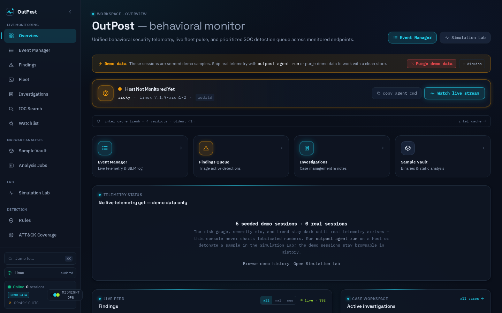
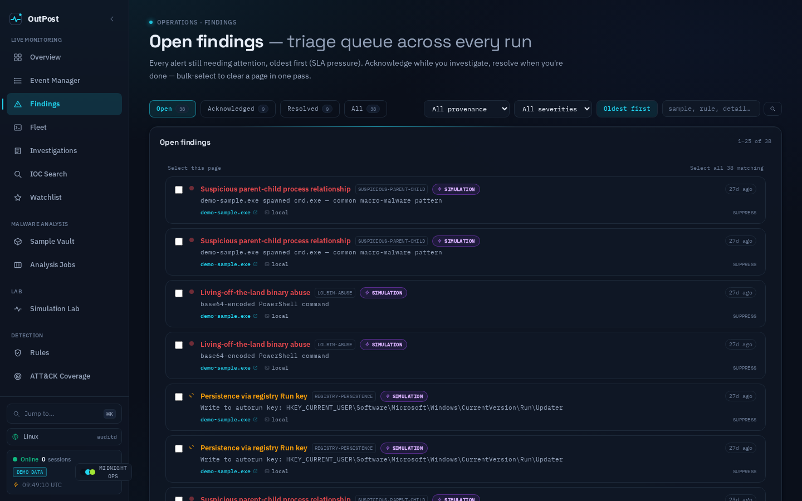
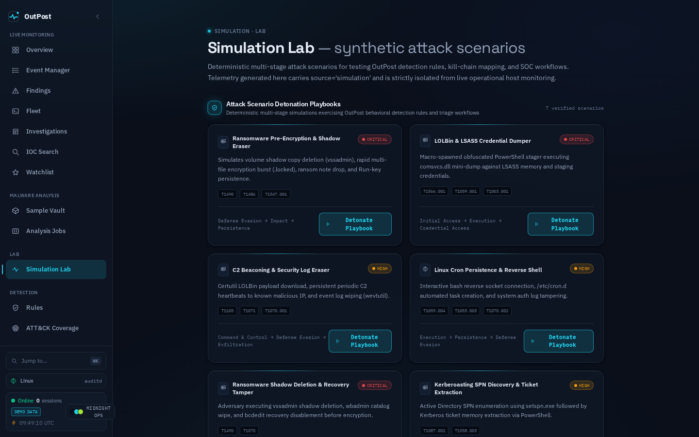
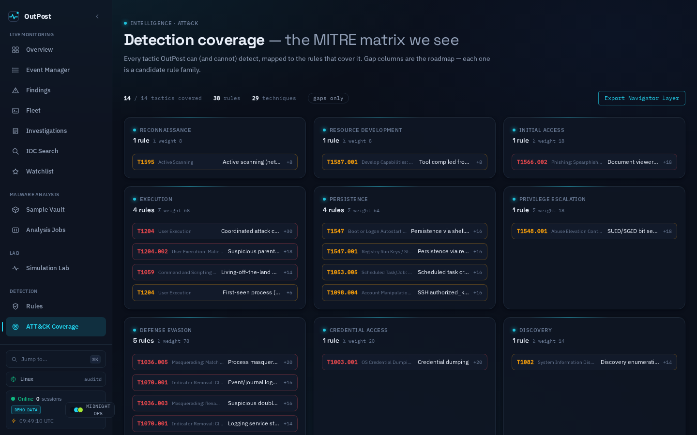
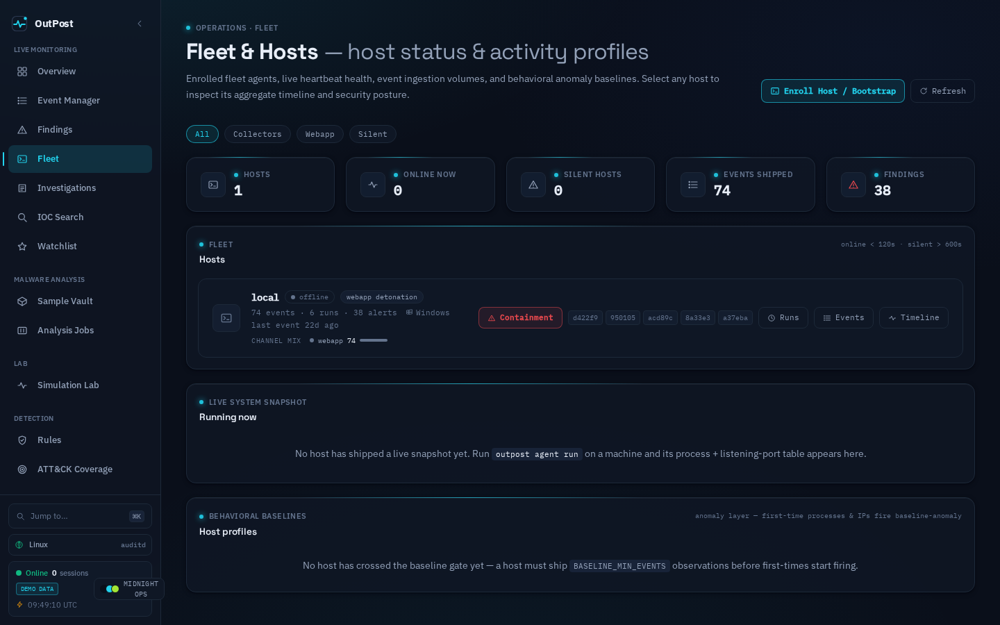
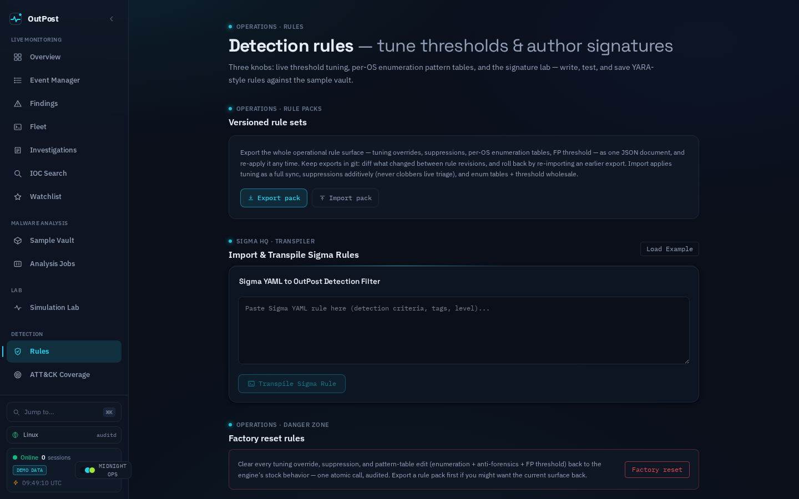
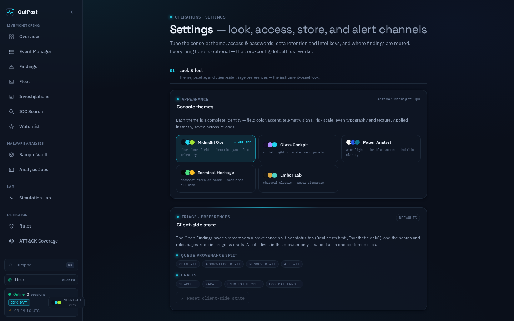

<div align="center">

# 🛡️ OutPost

### Cross-Platform Behavioral Security & Telemetry Monitor

*A self-hosted, explainable SOC monitoring platform and malware analysis workbench with dual first-class interfaces: a reactive web deck and an interactive terminal console.*

`FastAPI` · `React 19` · `TypeScript` · `Vite 6` · `Tailwind CSS v4` · `SQLite / PostgreSQL` · `Typer` · `Rich` · `Playwright`

[](https://python.org)
[](https://fastapi.tiangolo.com)
[](https://react.dev)
[](https://www.typescriptlang.org)
[](https://github.com/kripy17/OutPost/actions)
[](docs/11-DETECTION-LOGIC.md)
[](docs/09-CLI-SPEC.md)
[](docs/11-DETECTION-LOGIC.md)
[](LICENSE)

</div>

<p align="center">
  
  <br>
  <em>Workspace Overview — threat posture, quick actions, live findings feed, and active investigations.</em>
</p>

---

## 📖 What is OutPost?

**OutPost** is an open, self-hosted behavioral security monitoring system that provides deep observability, anomaly detection, and automated threat triage across Windows, Linux, and macOS endpoints.

Unlike opaque ML-based platforms, OutPost uses **deterministic, explainable rule-based heuristics** mapped directly to the **MITRE ATT&CK** matrix. Telemetry flows from kernel and OS primitives (`auditd`/`eBPF` on Linux, `Sysmon` on Windows, `EndpointSecurity` on macOS), gets normalized into a unified event schema, and is enriched in real time against **four threat intel sources** (AbuseIPDB, VirusTotal, URLhaus, ThreatFox).

### The Three Product Domains

| Domain | What it does | Data source |
|---|---|---|
| 🔴 **Live Host Monitoring** | Watches production endpoints via lightweight collector agents. Raw OS events (process execution, sockets, file writes, registry) flow through ingestion into the detection engine. | `source="live"` — `POST /ingest/batch` |
| 🔬 **Malware Analysis & Sample Vault** | Binary intake, SHA-256 deduplication, static disassembly (PE/ELF headers, strings, entropy, IOC extraction), CAPA capability analysis, YARA scanning, and external sandbox dispatch (Any.Run, Hatching Triage, Joe Sandbox). | `source="sandbox"` |
| 🧪 **Simulation Lab** | 7 verified attack scenario playbooks executed in complete isolation from live feeds — validate rules, test alert pipelines, train SOC analysts. | `source="simulation"` |

---

## ✨ Key Capabilities

| Capability | Description |
|---|---|
| 🖥️ **38 Detection Rules** | OS-aware heuristics across all **14 MITRE ATT&CK tactics** — LOLBin abuse, C2 beaconing, reverse shells, ransomware file encryption, credential dumping, DNS tunneling, lateral movement, and more. |
| 🆔 **Kernel-Resolved Process Identity** | Evaluates true kernel binary paths (`auditd exe=` / `Sysmon Image`) rather than spoofable process command names. |
| 🎨 **5 Console Themes** | Midnight Ops, Glass Cockpit, Paper Analyst, Terminal Heritage, Ember Lab — each a complete visual identity applied instantly. |
| 📡 **4 Threat Intel Sources** | AbuseIPDB, VirusTotal, URLhaus (abuse.ch), and ThreatFox — cache-first with fail-closed offline mode. |
| 🔬 **CAPA Integration** | Mandiant CAPA capability extraction on uploaded binaries — maps behaviors to ATT&CK techniques and MBC categories. |
| 🔒 **Active Containment** | 1-click host isolation from the Fleet page when a monitored endpoint is compromised. |
| ⛈️ **Alert Storm Guard** | Per-rule burst caps preventing console flooding on long-running live sessions. |
| 🗂️ **Campaign Clustering** | Graph clustering groups sessions sharing C2 IPs or file hashes into aggregated campaign threat cards. |
| 📡 **Real-Time SSE Broadcast** | Server-Sent Events stream live alerts, status transitions, and triage updates without polling. |
| 🔒 **Air-Gapped by Design** | Zero external CDNs, fonts, or analytics. Self-contained fonts and verified offline runtime guarantees. |
| ⌨️ **First-Class CLI Parity** | **31 commands**, Rich color formatting, interactive TUI console, and headless scripting support. |
| 🧪 **7 Simulation Playbooks** | Pre-built attack scenarios (ransomware, credential dumping, C2 beaconing, reverse shell, Kerberoasting, SPN discovery) with 1-click detonation. |

---

## 🖥️ Web Console Pages

<table>
<tr>
<td width="50%">

<p align="center">
  
  <br><em>Open Findings — triage queue with bulk actions, provenance badges, and severity filters.</em>
</p>

</td>
<td width="50%">

<p align="center">
  
  <br><em>Simulation Lab — 7 verified attack scenario playbooks with 1-click detonation.</em>
</p>

</td>
</tr>
<tr>
<td>

<p align="center">
  
  <br><em>ATT&CK Coverage — 14/14 tactics, 38 rules, 27 techniques with Navigator export.</em>
</p>

</td>
<td>

<p align="center">
  
  <br><em>Fleet & Hosts — heartbeat health, behavioral baselines, and active containment.</em>
</p>

</td>
</tr>
<tr>
<td>

<p align="center">
  
  <br><em>Detection Rules — threshold tuning, versioned rule packs, and Sigma transpiler.</em>
</p>

</td>
<td>

<p align="center">
  
  <br><em>Settings — 5 console themes, triage preferences, intel API keys, and alert channels.</em>
</p>

</td>
</tr>
</table>

The web console has **22+ pages** organized into functional categories:

| Category | Pages |
|---|---|
| **Live Monitoring** | Overview · Event Manager · Findings · Fleet · Investigations · IOC Search · Watchlist |
| **Malware Analysis** | Sample Vault · Sample Detail · Analysis Jobs · Analysis Detail |
| **Lab** | Simulation Lab |
| **Detection** | Rules · ATT&CK Coverage |
| **Session Detail** | Run Detail (kill chain, process tree, network, timeline, notes, detection rules) |
| **System** | Settings · Audit Log · Host Detail |

---

## 🚀 Quickstart

### Prerequisites

- **Python 3.10+**
- **Node.js 18+**

### Linux / macOS

```bash
# Option A — Simple (installs deps + starts the stack)
./setup.sh          # Create venv, install backend + CLI + frontend
./start.sh          # Launch backend (:8001) + web console (:5174), open browser

# Option B — Developer workflow (recommended)
bash scripts/install.sh          # Full install + demo data seed + Playwright
bash scripts/dev.sh start        # Detached start with PID tracking + health checks
bash scripts/dev.sh status       # Check what's running
bash scripts/dev.sh logs         # Tail server logs
bash scripts/dev.sh stop         # Clean shutdown
```

### Windows (PowerShell)

```powershell
.\setup.ps1          # Create venv, install backend + CLI + frontend
.\start.ps1          # Launch backend + web console, open browser
```

### Docker

```bash
docker compose up --build
# Webapp: http://localhost:5174   API: http://localhost:8001
```

### CLI Quickstart

```bash
# Linux / macOS — zero-activation launcher
./cli.sh --help                  # Show all commands
./cli.sh                         # Launch interactive SOC Terminal (TUI)
./cli.sh alerts                  # Run any command directly

# Windows PowerShell
.\cli.ps1 --help
.\cli.ps1                        # Launch interactive TUI
```

> **Web Console**: [http://localhost:5174](http://localhost:5174)  ·  **API Docs**: [http://localhost:8001/docs](http://localhost:8001/docs)

---

## ⌨️ OutPost CLI Reference

The `outpost` CLI provides comprehensive SOC operations directly in your terminal — **31 commands** across 15 command groups plus an interactive TUI.

### Core Commands

```
outpost                            # Launch interactive SOC Terminal (TUI)
outpost run <sample> [--timeout N] # Upload, detonate, report + interactive analyst loop
outpost watch                      # Stream live host telemetry with recon markers
outpost list                       # List all sessions
outpost show <run_id>              # Full session report
outpost alerts                     # Inspect active alert queue (--provenance real|synthetic)
outpost triage <alert_id> <status> # Transition alert (open → acknowledged → resolved)
outpost search <indicator>         # Cross-session IOC search (IP, domain, hash, process)
outpost compare <run_a> <run_b>    # Diff two execution timelines side-by-side
outpost campaigns                  # Inspect auto-clustered adversary campaigns
outpost coverage                   # Display MITRE ATT&CK coverage matrix (14/14)
outpost samples                    # List uploaded binaries in the vault
outpost refresh                    # Refresh threat intel cache
outpost export <run_id>            # Export as STIX 2.1, CSV, PDF, or JSON
```

### Command Groups

```
outpost rules    {list,knobs,log-patterns}     # Detection rule tuning & inspection
outpost playbooks {list,run,show}              # Simulation Lab attack playbooks
outpost yara     {list,test}                   # YARA signature management
outpost watchlist {list,add,remove}            # IOC watchlist management
outpost allowlist {list,add,remove}            # Benign IOC allowlisting
outpost intel    {status,refresh,keys}         # Threat intel cache & API keys
outpost footprint <sample_id>                  # Passive DNS, CT certs, ASN metadata
outpost hosts    {list,show}                   # Per-host aggregate timelines
outpost notes    {list,add}                    # Analyst notes on sessions
outpost investigations {list,create,show}      # Incident case management
outpost analysis {list,show}                   # Analysis job management
outpost agent    {run,install}                 # Host collector agent
outpost admin    {backfill-channels,pg-migrate} # Database administration
outpost auth     {generate-token}              # Agent authentication
outpost settings {show}                        # Console preferences
```

---

## 🏗️ Architecture

```
┌─────────────────────────┐   ┌─────────────────────────┐   ┌─────────────────────────┐
│     Linux (auditd/eBPF) │   │     Windows (Sysmon)    │   │ macOS (EndpointSecurity)│
│     Collector Agent     │   │     Collector Agent     │   │ Collector Agent         │
└────────────┬────────────┘   └────────────┬────────────┘   └────────────┬────────────┘
             └─────────────────────────────┼─────────────────────────────┘
                                           ▼ POST /ingest/batch
                          ┌─────────────────────────────────┐
                          │         FastAPI Backend         │
                          │   • Unified Event Normalizer    │
                          │   • SQLite / PostgreSQL Storage │
                          │   • 38 Heuristic Detection Rules│
                          │   • MITRE ATT&CK Risk Scoring   │
                          │   • YARA Lab & CAPA Integration │
                          │   • 4 Threat Intel Enrichment   │
                          │   • Real-Time SSE Event Stream  │
                          │   • Dynamic Sandbox Execution   │
                          └────────────────┬────────────────┘
                                           │ REST API + SSE
                     ┌─────────────────────┴─────────────────────┐
                     ▼                                           ▼
          ┌─────────────────────┐                     ┌─────────────────────┐
          │     Web Console     │                     │     OutPost CLI     │
          │   React 19 + Vite 6 │                     │     Typer + Rich    │
          │  Tailwind CSS v4    │                     │  31 Commands + TUI  │
          │  5 Switchable Themes│                     │  Interactive Analyst│
          └─────────────────────┘                     └─────────────────────┘
```

---

## 🧪 Verification & Testing

OutPost maintains a comprehensive automated quality gate verifying every component:

```bash
./verify.sh
```

| Suite | Count | Covers |
|---|---|---|
| Backend pytest | **714+** | Ingestion, normalizers, rules engine, risk scoring, campaigns, search, SSE stream, YARA, CAPA, triage, PostgreSQL dialect |
| Collector pytest | **38** | Linux `auditd`/`eBPF`, Windows `Sysmon`, macOS `EndpointSecurity` shippers |
| CLI pytest | **134+** | All 31 CLI commands, Rich table rendering, argument validation, interactive TUI mode |
| Frontend | **365+** | Vitest unit tests + clean `tsc --noEmit` + Vite production build |
| ATT&CK Coverage | **14/14** | Complete matrix coverage across all ATT&CK tactics with 0 gaps |
| Playwright E2E | **54 checks** | Cross-browser layout verification across 18 routes and 3 responsive viewports |
| **Total** | **1,328+** | **All green** |

---

## 🔒 Scope & Safety Guarantees

OutPost is strictly a **defensive security monitoring and analysis tool**. It contains no weaponized payloads, exploits, or offensive automation.

- **Air-Gap Guarantee**: The web console ships with self-hosted fonts and assets (`frontend/public/fonts/`). No external analytics, trackers, or CDN scripts are loaded.
- **Sandbox Containment**: Dynamic detonation uses sanitized filenames (traversal-proof), minimal child environments (no operator secrets leak), and bounded execution timeouts. For strong isolation, run inside a container or VM.
- **Enrichment Safety**: Threat intelligence APIs require explicit user-configured API keys in `.env` and fail closed to offline mode when unconfigured.

---

## 📄 License

Distributed under the [MIT License](LICENSE).
