<div align="center">

# 🛡️ OutPost

### Cross-platform behavioral security monitor — a SOC console in your browser

Detonate samples, watch OS-aware detection rules fire in real time, score risk,
map kill chains, and cluster runs into campaigns — all through a polished
dark/light web deck with a full terminal mirror.

`FastAPI` · `React 19` · `Vite 6` · `SQLite` · `Typer` · `Rich` · `Playwright`


<p align="center">
  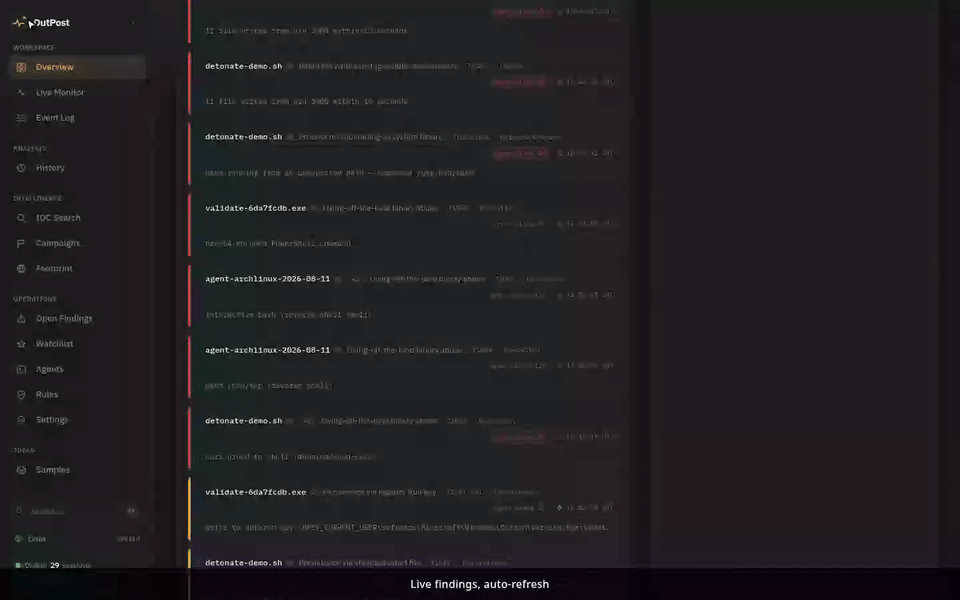
  <br>
  <em>The command deck — risk-over-time, detection volume, and the live findings feed.</em>
</p>

<p align="center">
  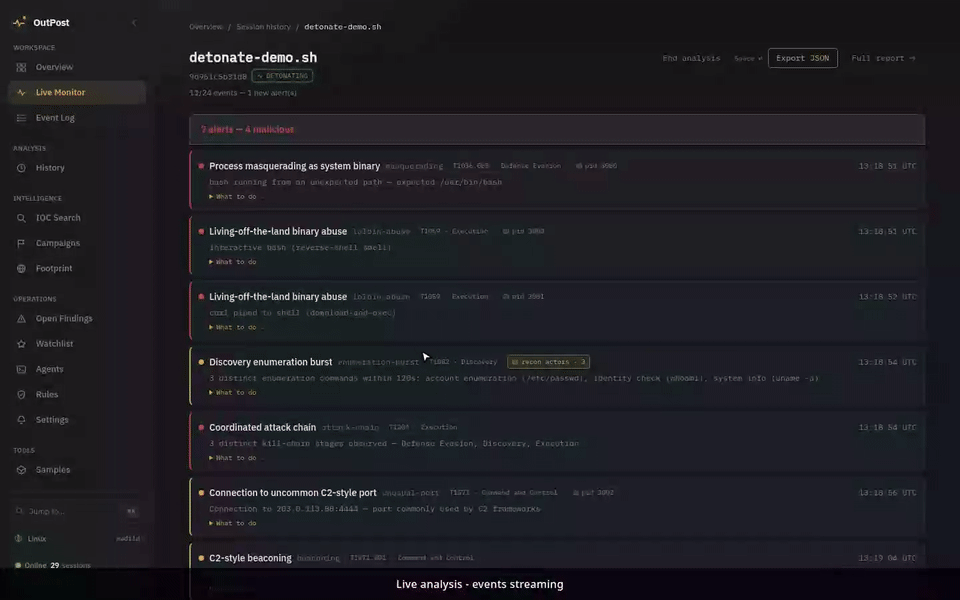
  <br>
  <em>Live analysis — a detonation streaming on the Monitor, then the run detail's process tree with risk halos.</em>
</p>

</div>

---

## What is OutPost?

OutPost watches **process, network, file, and persistence behavior** on
Windows, Linux, and macOS and flags malicious activity with **explainable,
rule-based heuristics** — no ML black box. Every finding is traceable to a
named rule, mapped to the **MITRE ATT&CK** kill chain, and scored 0–100.

It runs **fully synthetic scenarios** out of the box: stream a detonation and
watch alerts toast in live as the rules fire — dynamic malware analysis
without a sandbox, hypervisor, or malware.

**No OS picker anywhere** (the vision): on first open the webapp auto-detects
the host OS from the backend (`GET /platform`), tailors the install-agent
guidance to it, targets detonations at it by default, and the Overview's
host-status panel answers "is THIS host monitored?" against the live fleet.

> Originally built as a BSc Cybersecurity (Year 3) semester project. The
> internal design documents used to build it aren't shipped in this repo.

## ✨ Highlights

| | |
|---|---|
| 🖥️ **OS-aware detection engine** | **37 rules** across Windows / Linux / macOS covering all 14 MITRE tactics — LOLBin abuse, reverse shells, persistence, C2 beaconing, ransomware write bursts, process masquerading, DNS tunnels, fan-out plants, Discovery/Exfiltration chains |
| 🆔 **Resolved process identity** | Every rule keys on the **kernel-resolved path** (auditd `exe=` / Sysmon `Image`, shipped as `exe_path`) with a `process_name` fallback — masquerading judges the real binary, and nameless rows still match instead of silently skipping. The AST **identity gate** in `verify.sh` locks it so a future rule can't regress to spoofable name-only matching |
| ⛈️ **Storm guard** | Per-rule per-run alert caps (first-seen 20, beaconing 15, fan-out 10, default 25) with **held-back counts** surfaced on run detail and in exports — no alert flood on long live sessions |
| 📈 **Alert-rate sparkline** | Per-minute severity bars with a flood guide line, live on the Monitor and per-run on run detail |
| 🎯 **Risk scoring + ATT&CK** | 0–100 risk per run, severity bands, every rule mapped to a kill-chain stage, MITRE Navigator layer export, coverage matrix with gaps highlighted |
| 🗂️ **Campaign clustering** | Runs sharing IOCs auto-grouped into campaign cards — combined timeline, shared IOC evidence, signature C2, campaign-level STIX bundles |
| 💾 **Sample vault** | Upload binaries; magic-sniffing detects PE/ELF/Mach-O, **script shebangs**, and **.lnk/.zip/Office archives**; YARA signature lab + VirusTotal reputation |
| 🔎 **Footprint + intel** | Passive DNS / CT certificates / RDAP per sample (crt.sh, real when online, synthetic fallback), enrichment cache with force-refresh and stale sweeps, JSON/CSV footprint export |
| 🚀 **Sandbox detonation** | Push vault samples to Any.Run / Hatching Triage / Joe Sandbox and stream the report through the real detection pipeline — `scripts/validate_sandbox_provider.py` runs the live end-to-end gate when a provider key is configured |
| 📡 **SSE live push** | Fired alerts broadcast over `/events/stream` — StatusBar pulse, Monitor toasts, sparklines update instantly |
| 🖇️ **Correlation & triage** | IOC extraction/export, cross-run search, run comparison, watchlist (with live webhook/desktop alerts), alert triage lifecycle (open/ack/resolved + allowlists + suppressions, including rule+sample/IP value scopes from the findings sweep), STIX 2.1 + JSON + PDF export |
| 🧪 **Real-collector live mode** | `outpost agent run/install` — auditd/Sysmon telemetry streams into live sessions; heartbeat fleet with last-seen/uptime and silent-host flags |
| 🎨 **SOC deck UI** | Dark/light themes, collapsible rail, risk-over-time + detection-volume charts, kill chain, process tree with reputation halos, live monitor, browser notifications |
| ⌨️ **Terminal mirror** | The `outpost` CLI reaches the same API — **24 commands**, Rich tables, colorized risk, recon markers, rule knobs, alert-queue mirror (`outpost alerts --provenance real|synthetic`, saved per tab via `--save`, wiped with `outpost settings clear-prefs`), alert triage lifecycle (`outpost triage <id> <status> --comment`, bulk `outpost triage <status> <id1> <id2> …`), IOC allowlist (`outpost allowlist add|list|remove`), rule suppressions (`outpost rules suppressions add|list|remove`, run/value/global scopes) |

## 📸 Screenshots

<p align="center">
  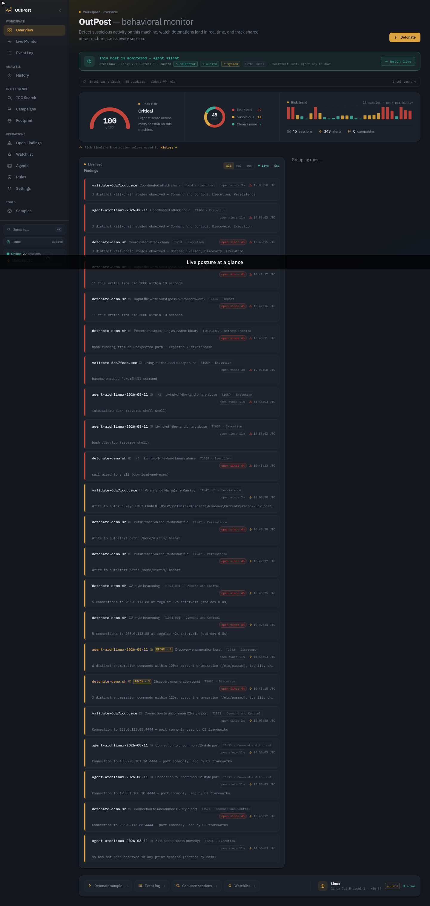
  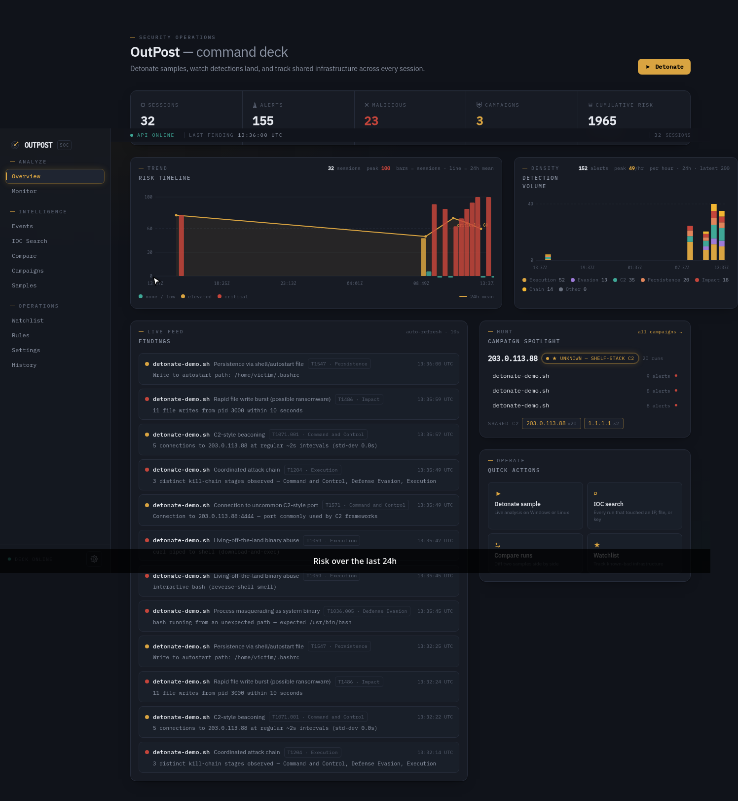
</p>
<p align="center">
  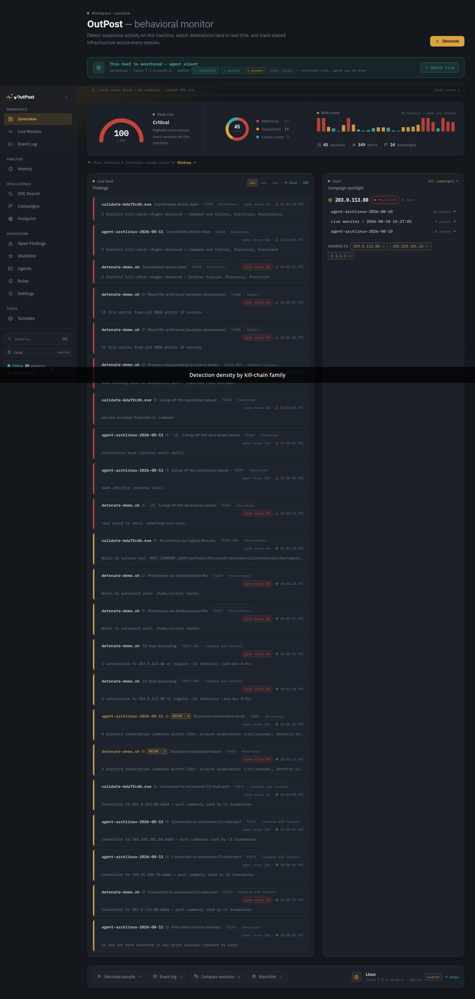
  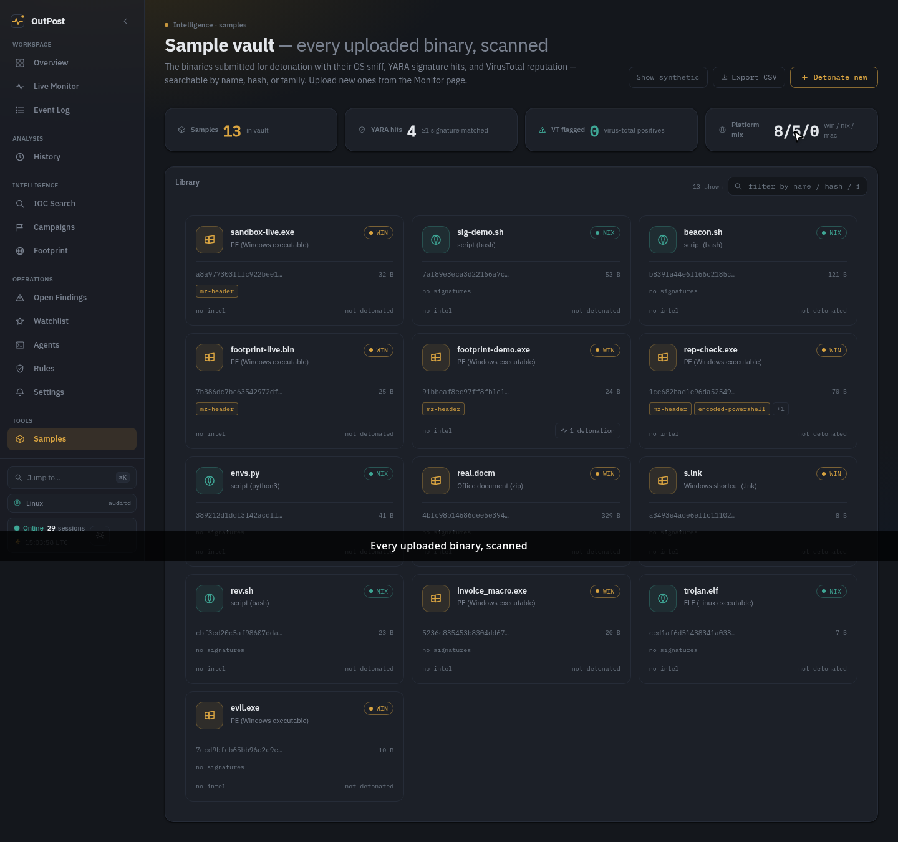
</p>
<p align="center">
  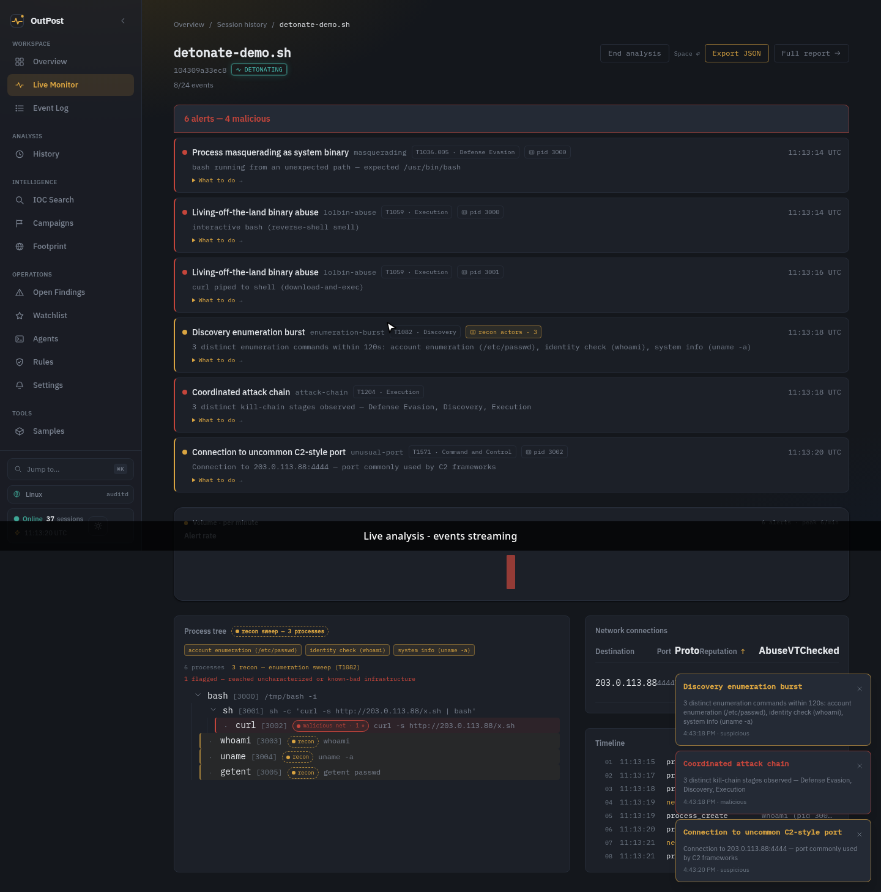
  
</p>
<p align="center">
  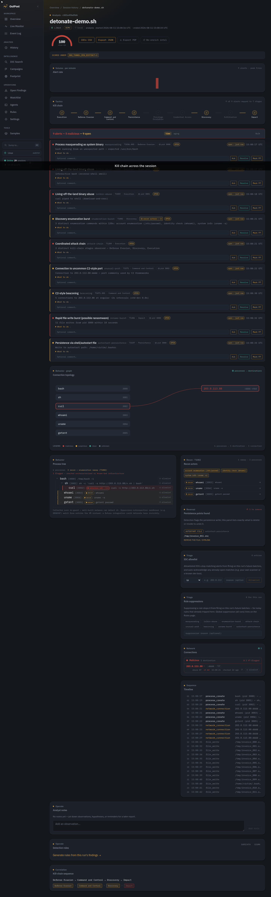
  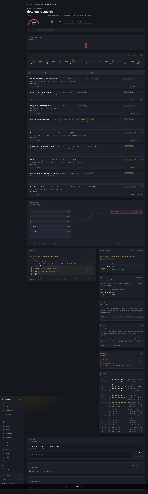
</p>
<p align="center">
  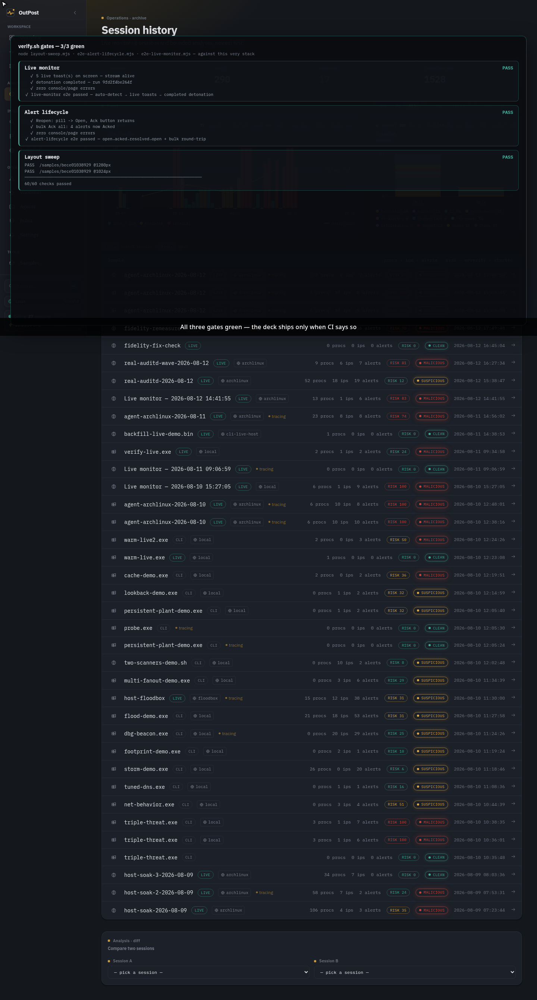
  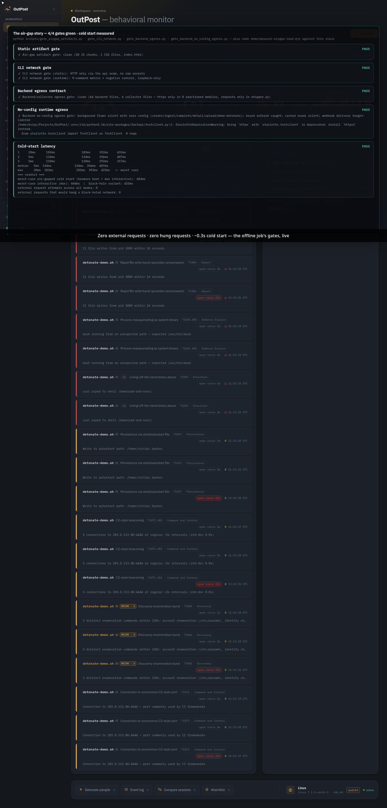
</p>

A **~150-second tightened walkthrough** (`demo/deck-demo-trimmed.webm`, 8 acts:
Overview → Sample vault → Monitor detonation → Run detail → Findings triage →
quality gates → the verify.sh gates run → **the air-gap story**) plus looping
**GIF previews** (`demo/deck-demo-preview.gif`, and the two hero GIFs above)
are recorded automatically by
[`demo/deck-demo.mjs`](demo/deck-demo.mjs) and edited with
[`demo/trim-demo.py`](demo/trim-demo.py) / [`demo/make-gif-preview.py`](demo/make-gif-preview.py).

The final frame is the air-gap guarantee, proven live: the offline job's four
gates — static artifact scan, CLI network matrix, backend egress contract,
no-config runtime egress — plus the measured cold-start harness (zero external
request attempts, zero hung requests, ~0.3 s worst case) run against the deck
and rendered as a verdict panel.

## 🏗️ Architecture

```
┌───────────────────┐   ┌───────────────────┐   ┌───────────────────┐
│ Windows (Sysmon)  │   │ Linux (auditd)    │   │ macOS (rule set)  │
│  collector        │   │  collector        │   │                   │
└─────────┬─────────┘   └─────────┬─────────┘   └─────────┬─────────┘
          └───────────────────────┼───────────────────────┘
                                  ▼  POST /ingest/batch
                 ┌──────────────────────────────────────┐
                 │            FastAPI backend           │
                 │  normalize · store (SQLite)          │
                 │  OS-aware detection engine           │
                 │  risk + ATT&CK · kill chain          │
                 │  process tree · enrichment · YARA    │
                 │  campaign clustering · SSE live push │
                 └───────────────────┬──────────────────┘
                                     │ REST API + SSE
                  ┌──────────────────┴──────────────────┐
                  ▼                                     ▼
        ┌────────────────────┐                ┌────────────────────┐
        │   React webapp     │                │   CLI (outpost)   │
        │   SOC deck UI      │                │   Rich terminal   │
        │   19 pages         │                │   24 commands     │
        └────────────────────┘                └────────────────────┘
```

**The backend is where the intelligence lives.** Collectors stay dumb
(telemetry → normalize → ship); the webapp and CLI are thin clients of one
API and one event schema — no feature lives in only one interface. The
**webapp is the primary interface**; the CLI is its deliberate terminal mirror.

## 🚀 Quickstart

> **PEP 668 note (Arch / Debian / Fedora):** your system Python refuses
> `pip` installs system-wide. That's expected — the installer creates a venv
> for you. Never use `--break-system-packages`.

Requirements: **Python 3.10+** and **Node 18+**.

```bash
# 1. One-command install (venv + backend + CLI + frontend + demo data)
bash scripts/install.sh

# 2. Start the stack (backend :8001 + webapp :5174)
bash scripts/dev.sh start
#    → webapp:  http://localhost:5174   API: http://localhost:8001

# 3. That's it — the webapp auto-detects this host's OS and
detonations/live sessions target it; detonate a sample on the Monitor page.
```

#### 🔬 Enable real sandbox detonations (Any.Run / Hatching Triage / Joe Sandbox)

Without a provider key the sandbox panel runs a clearly-labeled demo
detonation. To push samples to a **real** sandbox, export one provider key
and restart the backend so it picks it up:

```bash
# pick ONE provider — copy-paste the matching line, then restart:

export ANYRUN_API_KEY="your-anyrun-key"            # https://any.run → API access token
export TRIAGE_API_KEY="your-triage-key"            # https://tria.ge → Hatching Triage API key
export JOE_API_KEY="your-joe-key"                  # https://jbxcloud.joesecurity.org → API key

# optional: pin the active provider instead of auto-picking the first set one
# export SANDBOX_PROVIDER="anyrun"   # "anyrun" | "triage" | "joe"

bash scripts/dev.sh stop && bash scripts/dev.sh start
```

The Monitor's sandbox panel switches to the live provider automatically
(polling the analysis and streaming the report through the normal detection
pipeline). Verify the whole path with one command — it detonates a sample
end to end and asserts the events land in the run:

```bash
.venv/bin/python scripts/validate_sandbox_provider.py --backend http://127.0.0.1:8001
```

> Docker: the same vars work in `deploy/docker-compose.prod.yml` (the
> backend's `environment:` block already interpolates `ANYRUN_API_KEY` /
> `TRIAGE_API_KEY` / `JOE_API_KEY` from your shell).

Prefer to drive it by hand? [`scripts/install.sh`](scripts/install.sh) shows
every step it performs, in order.

### 🐳 Run with Docker (one command)

No local Python/Node needed — the whole stack (backend + webapp) builds and
runs in containers, with the SQLite database persisted in a named volume.

```bash
docker compose up --build
#    → webapp  http://localhost:5174   API: http://localhost:8001
```

The data volume survives restarts and rebuilds. On a remote server, rebuild
the frontend so the browser reaches the API at that server:

```bash
docker compose build --build-arg VITE_API_URL=http://<server>:8001 frontend
```

The **host agent is not part of the stack** — the collectors live on the
machines you monitor and stream into this backend (`outpost agent install`
on the target host, pointing `OUTPOST_API_URL` at the server).

**Production:** a TLS-terminated stack (Caddy front + auth on by default,
fail-closed) lives in [`deploy/`](deploy/README.md) — `docker compose -f
deploy/docker-compose.prod.yml up --build` with a public domain for
automatic Let's Encrypt, or a hardened systemd unit for the backend alone.

**Air-gapped by default.** The webapp makes **zero external HTTP requests**
and renders identically with the network fully blocked:

- **Self-hosted fonts** — IBM Plex Sans/Mono ship in the bundle
  (`frontend/public/fonts/`, local `@font-face`), so the signature
typeface never depends on the Google Fonts CDN.
- **No third-party calls** — no CDNs, telemetry, or icon services; the CLI is
network-minimal too (every request goes through one `api_client` seam,
loopback-only, enforced by a CI gate), and the backend's only outbound
calls are key/config-gated (enrichment, sandbox, passive DNS, webhooks) —
proven at runtime: with zero keys, the background flows make zero requests.
Run `bash scripts/airgap-verify.sh` for the one-shot verification of all
four gates plus the cold-start latency budget — see
[`docs/18-AIR-GAP.md`](docs/18-AIR-GAP.md) for the full guarantees and how
to run each gate standalone.
- **Enforced in CI** — both Playwright e2e gates treat *any* non-localhost
request as a console error, and a static gate scans the shipped build
(`dist/index.html` + every asset chunk) for external dependency syntax
(`scripts/gate_airgap_artifacts.py`), so an external dependency can never
sneak back in unnoticed.
- **Measured** — worst-case air-gapped cold start (browser boot + first
interactive render, production build, cache disabled): **≈ 0.3 s**
(`demo/measure-airgap-load.mjs`).

### Try it without a collector

The webapp and CLI run against **seeded demo data** — no live telemetry
needed:

```bash
source .venv/bin/activate
cd backend && python -m app.seed_demo        # a demo run with alerts
cd .. && outpost list                        # see it in the terminal
outpost campaigns                            # campaign clusters
```

Seeds: `app.seed_demo` (single run), `app.seed_campaign` (the **Shelf-Stack**
campaign pair sharing C2 `203.0.113.88`), `app.seed_macos` (a macOS
LaunchAgent/osascript run).

### CLI usage

```bash
outpost --help             # all commands
outpost list               # session history (colorized risk)
outpost show <run_id>      # full report: risk, kill chain, tree, network
outpost run <sample>       # analyze a synthetic sample
outpost watch              # live event watch mode (recon markers)
outpost search <ioc>       # cross-run IOC search
outpost compare <a> <b>    # diff two runs
outpost campaigns          # campaign clusters
outpost samples            # sample vault
outpost rules <run_id>     # Suricata/Sigma detection rules
outpost rules knobs        # tunable detection thresholds
outpost rules log-patterns # anti-forensics pattern tables
outpost watchlist          # add|list|remove|export|import
outpost notes <run_id>     # analyst notes
outpost yara list|test     # signature lab mirror
outpost footprint <sample> # passive DNS / CT / ASN per sample
outpost coverage           # MITRE ATT&CK coverage matrix
outpost intel              # enrichment cache status + refresh
outpost agent run|install  # bootstrap the host collector
outpost admin backfill-channels   # stamp channels on legacy events
outpost admin pg-migrate          # Tier 4: export SQLite → Postgres artifacts
outpost export <run_id> --format json|stix -o out.json
```

Point the CLI at a non-default backend with `OUTPOST_API_URL=http://localhost:8001`.

### Real-machine monitoring

- **Windows** — install Sysmon with `collectors/windows/sysmon_config.xml`,
  then run the collector.
- **Linux** — `sudo auditctl -R collectors/linux/audit.rules` (needs auditd),
  then run the collector.

The collector configs and shippers live in [`collectors/`](collectors/)
(`windows/`, `linux/`, plus shared tests).

## 🧪 Testing

One command runs the whole sweep:

```bash
./verify.sh
```

| Suite | Count | Covers |
|---|---|---|
| Backend pytest | **627** | ingestion, OS-aware rules (win/linux/macOS), risk + ATT&CK, campaigns, events search + channel-counts + log_source backfill, samples vault, SSE broadcast, notes, storm caps, triage (incl. rule+sample/IP value-scoped suppressions), footprint (cross-sample infra topology + RDAP registrar/registration timeline + domain WHOIS record + keyless breach exposure + live-provider HTTP wrappers + cache positive/negative branches), YARA, auth (fail-closed OUTPOST_AUTH_REQUIRED + agent token + rotation), fleet auth context + per-channel volume, Postgres migration core **+ live Postgres runtime dialect** (sqlite3-compat psycopg shim + translation layer + executescript statement-splitting tests), collector-fidelity fixes (exe-path masquerading authority on Linux AND Windows Image, per-channel beaconing, DNS/DoH exclusions incl. v6 resolvers), event-normalizer schema/coercion contract, report-export event-detail rendering + PDF artifact + JSON robustness branches, enrichment provider-path/cache-freshness/hash-reputation internals, sandbox live-provider adapters (anyrun/triage/joe submit→poll→fetch + failure/timeout/vanished-run/watchlist paths), **P0 schema foundations** (fresh-DB shape for investigations/IOCs/analysis_jobs + runs.kind, old-DB migration with data preservation + session_type→kind backfill, idempotent re-init, CHECK-constraint + foreign-key suites), **P0 resource APIs** (/findings queue + unread/mark-seen semantics + analyst findings, /iocs entity + provenance detail + audited disposition, /analysis persisted jobs with static execution + cancel + 501 for isolated-outpost, agent-denied auth for all three) |
| Collector pytest | **29** | Sysmon + auditd shipping, normalization, agent-token auth, comm=/exe= attribution fallback + family-aware IPv6 saddr parsing, SYSCALL+SOCKADDR connect merge + ppid-first pid fix |
| CLI pytest | **106** | rendering regressions (incl. intel-age staleness label), campaigns output, risk columns, YARA + footprint mirrors + exports, rules knobs, agent install (token embed + Windows bats), module entry, rotate-agent-token, fleet auth context in status, admin backfill-channels + pg-migrate wiring, alert-queue mirror (`outpost alerts` with status + provenance filters, `--save` per-tab persistence), `outpost settings clear-prefs` + the prefs store, alert-triage lifecycle (`outpost triage` ack→resolve→reopen with the transition-comment contract, PATCH URL/payload + DELETE parity), `outpost allowlist` group (add/list/remove with the relaxed 200/204 DELETE contract), `outpost rules suppressions` (list/add/remove, run/value/global scopes) |
| Frontend | **311** | vitest unit tests (page-contract suites for the coverage matrix, footprint topology + registration timeline + WHOIS timeline + breach note + shared-infra clusters + cluster-bar scaling + member-breakdown tooltip + deck-wide fill-pattern language (bars · timeline · kill chain · donut · severity dots) + synthetic detonation scenarios + clipboard fallback + SSE stream-hub fan-out + useEventStream ref pattern + theme-token reads, campaign sorts, sample vault, agents fleet, IOC search, watchlist, findings triage, chart + triage components, run-detail recon/attribution, log-pattern drafts, monitor reconciliation, static-analysis derivations, audit action chips, history archive totals, shared real-first preference (archive ↔ queue), queue-preferences wipe contract, sweep saved-split chips (per-tab derivation + shared vocabulary), one-click client-state reset (provenance + search/YARA/enum/log drafts) reachable from the ⌘K palette, browser-baseline check) + clean `tsc --noEmit` + Vite build |

Beyond the suites: the 14/14 ATT&CK coverage gate, both collector FP-baseline
soaks, the **sandbox provider gate** (`scripts/validate_sandbox_provider.py` —
runs a real Any.Run/Triage/Joe detonation end to end when a key is set,
SKIPs cleanly without one), the Playwright layout sweep, the post-deploy walk
(fail-closed auth + TLS + channel gate), and the doc-count gate all run as
steps of the same sweep.

**CI:** the same sweep runs automatically on every push and pull request via
[GitHub Actions](https://github.com/kripy17/OutPost/actions/workflows/ci.yml)
(the badge above reflects the latest run).

## 📚 Documentation

- **This README** — quickstart, CLI reference, testing, architecture.
- [`demo/README.md`](demo/README.md) — the automated Playwright walkthroughs
  (Shelf-Stack campaign arc + the deck demo video).
- **The code itself** — every backend service, route, and CLI command carries
  docstrings describing what it does and the rule logic behind it.

The original design documents used to build OutPost were internal build
context and aren't shipped in this repository.

## 🔒 Scope & safety

OutPost **monitors and analyzes** behavior — it generates nothing weaponized.
Detection runs on synthetic event streams by default, so the demo is safe to
run anywhere. Real malware should only ever run in an isolated environment
you're prepared to reset. Enrichment
(AbuseIPDB / VirusTotal) needs API keys in `backend/.env` and degrades
gracefully without them.

## 📄 License

[MIT](LICENSE) — built for a BSc Cybersecurity (Year 3) semester project.
